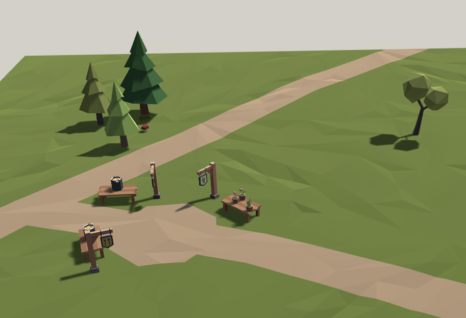

# Scene Synthesis with Automated Generation of Textual Descriptions

This repository contains the source Code for the Short Paper "Scene Synthesis with Automated Generation of Textual Descriptions" (*not published yet*). In this, we procedurally generate medieval village scene layouts with automated textual descriptions.

This source code is intended as a proof of concept and to understand it, we highly recommend reading the paper and its supplemental material. It includes two example graph grammars: One very basic grammar for scenes of colored cubes and spheres. It does not require any further dependencies, but is intended as an example and does not produce great results. The second grammar is the medieval village scene grammar we used for the paper. The full grammars are visualized in the files [SimpleGraphGrammar.svg](/SimpleGraphGrammar.svg) and [VillageGraphGrammar.svg](/VillageGraphGrammar.svg)  from this repository.

[Link to the paper](https://diglib.eg.org/handle/10.2312/egs20221026)

## Starting Point

In order to work with this source code, familiarity with the Unity Game Engine is required. 

Open the project in Unity 2020.2.3f1 (newer versions might work as well, revert back to this version if you run into problems). Select the scene "Assets/Scenes/AlgorithmScene" and start the Unity game mode. Here you can click "Run Algorithm" to generate a basic example scene containing boxes with text. This can serve as starting point to further explore the code base.

This basic example lacks some dependencies: Due to licensing issues, this repository does not contain the same assets as in the paper. In addition, no graph or plot output is supported (and some exceptions will be thrown when trying to output plots). The next two sections will explain how to install these optional dependencies.

## Install Asset Pack Dependency

In order to generate similar scenes as in the paper, a paid asset pack is required. To use it, perform the following steps:

1. Purchase the asset pack "Fantasy Village Pack" by "tarbo studio" https://assetstore.unity.com/packages/3d/environments/fantasy/fantasy-village-pack-140303.
2. Download the asset pack and put it into the folder `"Assets/Asset Packs/Tarbo-FantasyVillage"`.
3. To try it out open `"Assets/Scenes/AlgorithmScene"` in the Unity Editor and select the "Single Chain" object. In the section "Grammar Graph Generator" enter "VillageGraphGrammar" as the "Grammar Name". Click "Generate" in the "Grammar Graph Generator" section and then "Generate" in the "MCMC Scene Generator" section, to generate a scene and text with the village assets.

## Install Graph and Plot Dependencies

For actual development work we recommend installing a two additional dependencies to visualize the scene relationship graphs and get plot outputs. For plot output, the following is required:

1. Install Python 3 with `matplotlib` (https://matplotlib.org/).
2. To get an example plot, open `"Assets/Scenes/AlgorithmScene"` in the Unity Editor and select the "Single Chain" object. In the section "MCMC Scene Generator" sure "Draw Plots" is enabled and click "Generate". After the scene was regenerated, an evaluation score and an acceptance probability plot should be shown on screen in popup windows.
3. If plot output does not work yet, open `"Assets/Scripts/Generator/Helper/PlotViewer.cs"` and change the constant `python3Executable` to the absolute path of your Python 3 executable.

For graph visualization, the following is required:

1. Install graphviz (https://graphviz.org/).
2. To view an example graph, open `"Assets/Scenes/AlgorithmScene"` in the Unity Editor and select the "Single Chain" object. In the section "Graph Scene" click "View Graph in External Program".
3. If plot output does not work yet, open `"Assets/Scripts/Generator/Helper/DotFormatViewer.cs"` and change the constant `graphvizDotExecutable` to the absolute path of your graphviz `dot` executable.

## References

Our code builds on [NuGet for Unity](https://github.com/GlitchEnzo/NuGetForUnity) and [SharpSimpleNLG](https://github.com/nickhodge/SharpSimpleNLG), a C# port of [SimpleNLG](https://github.com/simplenlg/simplenlg). For all further references please refer to our paper.
